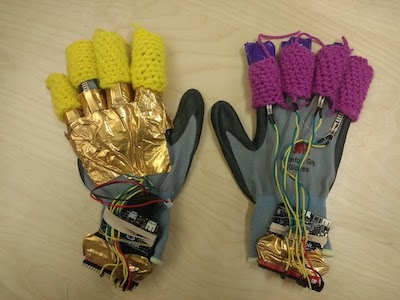

The [final writeup including images can be found on Google Drive using this link](https://docs.google.com/document/d/1YWDrIjmanhSp14MJpAYlezpDOOknQHYtI6t7iZDzUg0/edit?usp=sharing). The following write up is the text.

# Air Band: Final Report
Gabe Chapel, Jack DeMay, Mikhaila Friske, Bridget Murphy

Our project gives students and faculty the ability to play music without any physical “instruments”. In this project, we used machine learning and a combination of sensors to develop a simulated piano keyboard that users could play by merely moving their hands and fingers, without actually sitting in front of any keys. We tracked the user’s motion with a built-in webcam and embedded micro:bits and flex sensors into gloves to collect the input for the virtual instrument and send to a machine learning tool called Wekinator. We then trained the feature engineered flex sensor data and the pixel values in Wekinator to output piano sounds according to the user’s performance.
## Mission Statement
Our goal was to give people an embodied and interactive way to perform in an air band without the need for any musical instrument experience in an effort to make the user feel as if the music was coming out of thin air. Thus, we set out to create wearables where the technology was as integrated as possible, to keep the experience as authentic as possible.
## Challenges
Since we wanted to provide an authentic band experience for everyone, we aimed to integrate all of the sensors into different pieces of clothing, which would allow the users to embrace rock ‘n roll fashion while tracking their motion. This also allowed the project to take place anywhere, since static equipment was not required. However, this also introduced several challenges, since we needed to make the clothing adaptable to and comfortable for different body types. With regards to keeping people comfortable while they performed, we needed to make the sensors as non-intrusive as we could with careful placement and fabrication. This was especially difficult with implementing flex sensors and Micro:bits into gloves, which, after considering the hardware options and reducing the scope of the project, became the only embedded hardware, as discussed in a later section. The first issue was finding gloves that could form to a wide range of hand sizes, so that the sensors and controllers would not shift around too much. We found 3M Comfort Grip Gloves to be well suited for this application. The next problem was securely fastening all of the components to the glove, with the flex sensors on each finger and the micro:bit on the user’s wrist. We iterated through using electrical tape, an outer latex glove layer, duct tape, rubber bands, knitted finger sweaters, and simple sewing techniques to keep the sensors in place, and decided to use a combination of the duct tape, sweaters, and sewing. Taping both ends of the sensors led to them bending and remaining bent, so we needed to make one end fixed and one end able to slide up and down the finger. This is where we utilized sewing and knitting. One end of the sensors was taped to the glove while the other had thread sewn across it to allow sliding. The fingers were then wrapped by knitted sweaters to retain the natural flexibility of the gloves while fixing the sensors to the user’s fingers. We also sewed thread through the gloves and across the top of the micro:bits to secure them to the user’s hands.

Another major challenge we ran into was trying to integrate the Microsoft Kinect to be used for motion tracking. We were initially told that this feature extractor was not the best choice, based on the fact that we were all using Mac OS X and the Kinect is made for Windows, but we decided to try it regardless. The first problem we found was that Kinect skeleton tracking was not supported for Mac, though we found some workarounds, such as Skeleton Jelly, OSCeleton, and libfreenect. After about 2 weeks of trying to debug the interface to get it to be compatible with our application, we decided to switch to a Javascript-based color tracking system that used the built-in webcam on our laptops to track the bright colors of a user’s gloves. This, however, led to more challenges, as we tried to obtain consistently accurate readings of the user’s hand positions.

The main challenge we encountered when using the webcam for tracking colors (the yellow and magenta finger sweaters we crocheted for the keyboard gloves) was noise in the surroundings. Originally we were only sending 40 inputs, averaging out large sections of the webcam. However, this quickly proved to not be conducive in producing inputs that actually detected the colors, so we moved this up to 800 inputs, hoping this would be able to pick up our bright (mostly) uncommon colors, magenta and yellow. However, we noticed that there seemed to still be a lot of noise in both the classification and regression. In an effort to remedy this, we did two things. The first was keeping the 800 inputs, but cutting the webcam in half, which means we were averaging out twice as many spaces, but only in the bottom half. We used this technique because even when users were standing away, they still were only utilizing the bottom half of the webcam’s view. The second was to determine if a color was close to our magenta or yellow crocheted finger sweaters, and if it was not, we calculated the grayscale of that color. Both of these were to make it easier for the machine learning algorithm to determine the thresholds.

## User Experience
First, the user, Ludwig, slid on the gloves and ensured that all of the components were secure, adjusting them until they were comfortable. Since he was wearing some bright yellow and magenta on his shirt, Ludwig also had to throw on a provided rockstar vest. The rest of the experience, then, took place in front of the computer’s webcam. Ludwig could stand anywhere within the webcam’s field of view, but it worked the best between 2 and 6 feet from the computer. After starting a node server and while at the address http://localhost:4243/training/, he could then begin training his hand movements.

Ludwig started with training the left hand, holding it down as low as he wanted keys to be played and as far left as he wanted the lowest key to be (within the webcam’s field of view). To record the video data, he pressed the spacebar and waited until the recording icon turned red. He had 3.5 seconds to resituate himself before the recording began, when he had to hold his hand in the desired position. This recording lasted 5 seconds. Using the right arrow key, he then followed the same procedure for the middle key and the highest or rightmost key. Once he finished training on his left hand, Ludwig repeated the process on his right hand. To complete the training, he, finally, had to record the absence of his hand, so he pressed record and held his hands outside of the webcam’s field of view. With the right arrow key, Ludwig then submitted the training data and pressed the spacebar to start running the air keyboard application.

On the application, he saw a clear illustration of himself in addition to a pixelated video display. The pixelated display looked grayscale but illuminated his gloves as they entered the frame. This was followed by the sound of piano keys being played. As Ludwig moved his fingers, he heard the number of notes change, and as he moved his hands, he heard the pitch of the notes change. Satisfied with his performance, he pressed the spacebar again to stop the app and returned the vest. Though fond of the stylish gloves, he reluctantly took them off as well. 
## Technologies
Regardless of which instruments we intended to create, we needed at least two components: a computer for each instrument to analyze the user’s physical input and subsequently generate a musical output as well as a speaker to amplify that output. Most of the technologies we needed, though, depended solely on the instruments we were simulating, so, in addition to these, we also used sensors specific to the motions of a pianist. For the sake of simplicity and to reduce the amount of hardware troubleshooting, the main sensor for large-scale motion detection was web camera and micro:bits were used for more precise measurements, transmitting to a separate micro:bit connected to the computer. Micro:bits are small microcontrollers with analog-capable GPIO pins and a series of integrated sensors, such as an accelerometer, gyroscope, magnetometer, and radio antenna. For the piano, though, we only used the pins to read analog data and the radio to communicate from micro:bits connected to battery packs to another connected to the computer.

We divided the expected motions into three major components: whether the user is playing or not, the range at which the user plays, and the notes he or she plays at that range. The gloves we used for this instrument had brightly colored, knitted finger sweaters, one hand with magenta and one hand with yellow, to be easily identified by the webcam for position tracking. They both also had a set of four flex sensors connected to a micro:bit to capture the user’s finger motion. These sensors were connected to the pins on each micro:bit, using a micro:bit breakout board, as shown in the figure below.

Each sensor acted as a variable resistor and had two pins, one of which we connected to a 5V power supply, and the other through a 47kΩ resistor to a common ground. This circuit is known as a voltage divider, as shown below, where the voltage across the known 47kΩ resistor (output voltage) varies as the unknown resistor value changes. Since the flex sensors’ resistance values change when bent, we determined how much the sensors were flexed by measuring this resulting output voltage.

The flex sensors bent with the user’s fingers and determined which notes he or she wanted to play out of a set of four, where bent fingers corresponded to which keys would be played. This then, combined with a linear regression algorithm, could be used to determine the range at which that set of four notes would be played on the keyboard. We used the webcam with regression to identify the horizontal position of the user’s hands. Finally, to identify whether the user actually played the notes intended by the flex sensor status and horizontal position, we trained a another classifier to observe the vertical position of the brightly colored gloves and set a threshold. When the user’s hands were below this threshold, the computer generated a sound and when the user’s hands were above the threshold, it stopped. Given the width of the webcam’s field of view, we only allowed the user 25 keys to play, but this gave more control required less precision to play each individual note.

All of these inputs were received or recorded by our web application that used serial port, OSC, and socket.io NPM packages. Once received, they were sent via OSC to a Wekinator project over localhost:6448/air_band/keyboard/inputs. In Wekinator, we used 808 inputs, 800 from the webcam and 8 from the flex sensors, to train 10 classifiers and 2 regressors. Out of the 10 classifiers, 8 of them were used to determine whether the user’s fingers were bent so we trained them with K Nearest Neighbor with 1 neighbor, which worked well and produced very responsive results. The other 2 classifiers, though, were used with the video feed to determine whether the user’s hands pass the horizontal threshold and indicate playing the keys. With more inputs available, we wanted to reference more neighbors, but since video input is more susceptible to noise, we limited it to 3, which did not work as well as we had hoped. We also tried Decision Stump, since each classifier only had two classes, but it did not recognize any change in the video feed. Thus, we stuck with K Nearest Neighbors and tried adjusting the input stream, as discussed in the Challenges section. The regressors were used to determine horizontal hand position and we tried both Linear Regression and Neural Networks. Neural Networks consistently output values at either end of the regression range and did not produce much in the middle, regardless of how the user moved his or her hands. In addition to this, the nets also took minutes to train, which was not acceptable for our intended use. The Linear Regression, though, trained within a few seconds and produced results that correlated more closely to the user’s motions. The training of our application was done using a series of socket events that then would determine which Wekinator control messages to be sent. The web application then received the outputs from Wekinator and sent them to browser pages to determine what sounds should be played. A schematic of the encompassing system is shown in the figure below.

## Unmet Ambitions
The main aspect of this project that we did not accomplish that we had anticipated was allowing multiple users to play multiple instruments together. We encountered issues quickly with regards to integrating all of our sensors into the user’s clothing when we tried to determine the distance between two micro:bits. We found that the magnetometers were not strong enough to detect a magnet small enough to wear, so we tried to obtain the distance by using the micro:bit’s signal strength measurements. This, however, also proved to be insufficiently strong and was extremely sensitive to the motion and orientation of the micro:bits. Since our initial designs for the air guitar and air keyboard significantly relied on this information, we had to pivot and utilize a different technology. We decided that a camera would provide us with the most encompassing functionality, in terms of determining the location of a user’s body parts, and, though we could not embed the camera into the user’s clothing, it still provided a reliable and nonintrusive method for position tracking. Since the position information needed for the keyboard was similar to that of the drums (x and y positions of the user’s hands), we began developing these instruments first.

As stated previously, though, our Macs were not conducive to using the Microsoft Kinect, so we had to try to use a webcam for our position tracking instead. This, as mentioned before, was also a challenge and took time to troubleshoot, so we ended up trying to just develop a single, fully functional air instrument. The keyboard required less precision and less video analysis than the drums, since all of the notes could be played on a single horizontal plane, and did not need acceleration data from the micro:bits. Thus, we decided to pursue it rather than the guitar or drums.
## Ethical Questions
By creating these embodied interactions through clothing, we limited our user base to mobile people. In this way, we discriminated interactions for those who may not have been able to intricately move their fingers or arms and those who did not fit into the gloves that we provided. Though we saw this as a limiting factor, we thought that the work done to create these embodied wearables could lead to provoking ideas around accessibility for future work.
## What We Learned
Although the skills and experience varied between each of the team members involved in this project, it still required a significant amount of trial and error to obtain the desired results. We found many ways to solve the issues that we encountered among hardware, software, and design interfaces and gained important insight in the process.

One of the first things we explored was communication between more than two micro:bits using the built-in radio transmission functionality, in which we found the ability to control and monitor signal strength. This helped us learn how to efficiently send readable data in JavaScript and perform basic data parsing in Python on the receiving end. Within the micro:bits, we found built-in gesture functions, such as shake and 3G, but we also discovered limitations of the integrated sensors, which, ultimately, deterred us from pursuing a more encompassing collection of wearables. In addition to this, we learned that the Microsoft coding environment for micro:bit, MakeCode, is prone to freezing and hogging bandwidth, especially on Google Chrome. We encountered these issues less frequently when using Safari.

Along with communicating through micro:bits, we also learned how to locally communicate with Wekinator through a browser, using OSC and web sockets. This required us to become familiar with using OSC events in JavaScript to control Wekinator through a web application. Since the app used musical audio outputs, we needed to know how to use the Tone.js framework, a framework for loading and playing audio files. Unfortunately, we also found that the audio output was inconsistent across different computers’ browsers and was not always supported. This process of constructing a functional web app, of course, also required us to know how to adequately debug the code, which meant understanding the workflow of the app and inspecting the web page. 

As stated previously, we also found that Mac OS is not conducive for body tracking with a Kinect, so we used a video feed, with which we tried several techniques to retrieve the desired data as effectively as we could. This included reducing the video size to only capture the user’s hands and searching only for the colors of the knitted finger sweaters. The color search took several attempts in which we removed specific ranges from the produced RGB values, such as subtracting the resulting blue from green in a pixel to obtain only yellow, until we could accurately detect the sweaters. Through these trial and error steps, we learned that using machine learning to capture specific colors through video input is difficult and very sensitive to the environment. We had to retrain, and sometimes adjust the color range that we were searching for, whenever we moved the camera, due to changes in lighting and scenery. The color on users’ clothes also largely affected the results, and it often failed when different people tried to use the same training data. 

Lastly, we gained some insight regarding the fabrication of wearables. When attempting to fit gloves to several different sized hands, we found it important to avoid wrapping anything around the fingers, wrist, hand, or any other part of the glove, as it reduces the flexibility of the glove. Taking exact measurements of the gloves would have also been useful for cutting the flex sensor wires to the correct length and making fastening the sensors easier. Fixing one end of the sensors and keeping the other more malleable, though, proved to be the best option for dynamic sensors and taught us some basic sewing techniques.
## Future Work
Since our air band had to be reduced to just one instrument, the main aspect we would want to work on in the future, aside from solving the audio output issue across different computers’ browsers, is integrating an air guitar and an air drum. This could be accomplished in a similar manner as with the keyboard that we finished, and we, in fact, even began constructing the drum. Ideally, we would obtain a Windows machine to utilize the skeleton tracking from the Microsoft Kinect for more accurate motion tracking than the webcam, though we would use it for the same large-motion hand tracking for each instrument. With the drums, we would observe when the user’s hands pass through various regions, acting as individual virtual drums. The drum hits would then be indicated by the micro:bit’s built-in 3G gesture event, an accelerometer-based measurement that we did get working with Wekinator. The guitar would, similarly, use the micro:bit’s acceleration data to monitor the user’s strumming patterns and the Kinect to measure user’s left hand position. The guitarist’s left hand would also be the same design as the keyboard gloves, with flex sensors to determine finger motion. Providing other instruments would allow users to collaborate in a fun and creative way and generate music together.

Our original stretch goals also included implementing a modular system for left-handed and right-handed people and implement a time-dependent audience response element. The modular system would allow left-handed and right-handed people to play the instruments how they are most comfortable playing and the audience element would be a positive or negative response to how well the band is playing together. While we didn’t have time to get into creating the interface for the guitar, the left-hand/right-hand adaptability would be possible by switching the colors in the training model for our keyboard program. The drummer could also change left-hand/right-hand or even left-foot/right-foot by simply training the data with drums on the opposite side. 
